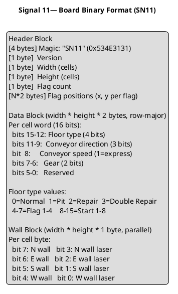

# Signal 11 — Solution Scaffold Implementation Plan

> **For agentic workers:** REQUIRED SUB-SKILL: Use superpowers:subagent-driven-development (recommended) or superpowers:executing-plans to implement this plan task-by-task. Steps use checkbox (`- [ ]`) syntax for tracking.

**Goal:** Create a fully scaffolded .NET 10 solution with all projects, references, dev scripts, and repo files — no game logic yet, but everything builds and tests run green.

**Architecture:** Domain library + Server + REPL Client as three separate .NET projects in a single solution. Five test projects (unit + integration) wired with correct project references. Dev scripts wrap dotnet CLI for consistent local workflow.

**Tech Stack:** .NET 10, ASP.NET Core 10 minimal API, xUnit, Bash scripts

> **Note on TDD:** This plan is pure infrastructure — no game logic to drive with tests. TDD applies from Plan 2 onward. The verification step here is `dotnet build` + `dotnet test` passing on an empty, correctly-wired solution.

---

## File Map

**Created by this plan:**

```
Signal11.sln
global.json
.gitignore
README.md
CLAUDE.md
ETHOS.md
LICENSE

src/Signal11.Domain/Signal11.Domain.csproj
src/Signal11.Domain/Signal11.Domain.csproj          (classlib, net10.0)

src/Signal11.Server/Signal11.Server.csproj           (webapi, net10.0)
src/Signal11.Server/Program.cs                       (minimal, no sample code)
src/Signal11.Server/appsettings.json
src/Signal11.Server/appsettings.Development.json

src/Signal11.Client.Repl/Signal11.Client.Repl.csproj (console, net10.0)
src/Signal11.Client.Repl/Program.cs                  (stub entry point)

tests/unit/Signal11.Domain.Tests/Signal11.Domain.Tests.csproj
tests/unit/Signal11.Domain.Tests/PlaceholderTest.cs

tests/unit/Signal11.Server.Tests/Signal11.Server.Tests.csproj
tests/unit/Signal11.Server.Tests/PlaceholderTest.cs

tests/unit/Signal11.Client.Repl.Tests/Signal11.Client.Repl.Tests.csproj
tests/unit/Signal11.Client.Repl.Tests/PlaceholderTest.cs

tests/integration/Signal11.Domain.Integration.Tests/Signal11.Domain.Integration.Tests.csproj
tests/integration/Signal11.Domain.Integration.Tests/PlaceholderTest.cs

tests/integration/Signal11.Server.Integration.Tests/Signal11.Server.Integration.Tests.csproj
tests/integration/Signal11.Server.Integration.Tests/PlaceholderTest.cs

dev/build.sh
dev/run.sh
dev/test.sh
dev/docker-compose.yml
dev/README.md
dev/scripts/new-game.sh
dev/scripts/watch-game.sh
dev/seed/boards/.gitkeep
dev/seed/games/.gitkeep

designs/2026-04-02-signal11-design.md               (already exists)
designs/system-context.puml                          (stub)
designs/container.puml                               (stub)
designs/board-format.puml                            (stub)

requirements/MISSION.md
```

---

## Task 1: Initialize Git, SDK Pin, and Solution

**Files:**
- Create: `.gitignore`
- Create: `global.json`
- Create: `Signal11.sln`

- [ ] **Step 1: Initialize git repo**

```bash
cd /home/colin/PROJECTs/i.🩷.robo.rally
git init
```

Expected: `Initialized empty Git repository in .../i.🩷.robo.rally/.git/`

- [ ] **Step 2: Generate .NET gitignore**

```bash
dotnet new gitignore
```

Expected: `.gitignore` created.

- [ ] **Step 3: Create global.json to pin .NET 10 SDK**

Create `global.json`:
```json
{
  "sdk": {
    "version": "10.0.100",
    "rollForward": "latestMinor"
  }
}
```

- [ ] **Step 4: Create the solution**

```bash
dotnet new sln -n Signal11
```

Expected: `Signal11.sln` created.

- [ ] **Step 5: Commit**

```bash
git add .gitignore global.json Signal11.sln
git commit -m "chore: initialize solution"
```

---

## Task 2: Create Source Projects

**Files:**
- Create: `src/Signal11.Domain/Signal11.Domain.csproj`
- Create: `src/Signal11.Server/Signal11.Server.csproj`
- Create: `src/Signal11.Client.Repl/Signal11.Client.Repl.csproj`

- [ ] **Step 1: Create Domain class library**

```bash
dotnet new classlib -n Signal11.Domain -o src/Signal11.Domain --framework net10.0
```

Expected: Project created at `src/Signal11.Domain/`.

- [ ] **Step 2: Remove template boilerplate from Domain**

Delete the generated stub class:
```bash
rm src/Signal11.Domain/Class1.cs
```

- [ ] **Step 3: Create Server web API**

```bash
dotnet new webapi -n Signal11.Server -o src/Signal11.Server --framework net10.0
```

Expected: Project created at `src/Signal11.Server/`.

- [ ] **Step 4: Strip Server sample code**

Replace `src/Signal11.Server/Program.cs` with a minimal stub:
```csharp
var builder = WebApplication.CreateBuilder(args);
var app = builder.Build();

app.MapGet("/health", () => Results.Ok(new { status = "online" }));

app.Run();
```

Delete weather forecast files if generated:
```bash
rm -f src/Signal11.Server/WeatherForecast.cs
```

- [ ] **Step 5: Create REPL console app**

```bash
dotnet new console -n Signal11.Client.Repl -o src/Signal11.Client.Repl --framework net10.0
```

Expected: Project created at `src/Signal11.Client.Repl/`.

- [ ] **Step 6: Replace REPL stub entry point**

Replace `src/Signal11.Client.Repl/Program.cs`:
```csharp
// Signal 11 — REPL Client
// Full implementation in Plan 5.
Console.WriteLine("SIGNAL 11 v0.1.0");
Console.WriteLine("NOT YET IMPLEMENTED.");
```

- [ ] **Step 7: Add all source projects to the solution**

```bash
dotnet sln add src/Signal11.Domain/Signal11.Domain.csproj
dotnet sln add src/Signal11.Server/Signal11.Server.csproj
dotnet sln add src/Signal11.Client.Repl/Signal11.Client.Repl.csproj
```

Expected: Each line prints `Project ... added to the solution.`

- [ ] **Step 8: Verify source projects build**

```bash
dotnet build Signal11.sln
```

Expected: `Build succeeded.` with 0 errors.

- [ ] **Step 9: Commit**

```bash
git add src/ Signal11.sln
git commit -m "chore: scaffold source projects"
```

---

## Task 3: Create Test Projects and Wire References

**Files:**
- Create: `tests/unit/Signal11.Domain.Tests/`
- Create: `tests/unit/Signal11.Server.Tests/`
- Create: `tests/unit/Signal11.Client.Repl.Tests/`
- Create: `tests/integration/Signal11.Domain.Integration.Tests/`
- Create: `tests/integration/Signal11.Server.Integration.Tests/`

- [ ] **Step 1: Create unit test projects**

```bash
dotnet new xunit -n Signal11.Domain.Tests \
  -o tests/unit/Signal11.Domain.Tests --framework net10.0

dotnet new xunit -n Signal11.Server.Tests \
  -o tests/unit/Signal11.Server.Tests --framework net10.0

dotnet new xunit -n Signal11.Client.Repl.Tests \
  -o tests/unit/Signal11.Client.Repl.Tests --framework net10.0
```

- [ ] **Step 2: Create integration test projects**

```bash
dotnet new xunit -n Signal11.Domain.Integration.Tests \
  -o tests/integration/Signal11.Domain.Integration.Tests --framework net10.0

dotnet new xunit -n Signal11.Server.Integration.Tests \
  -o tests/integration/Signal11.Server.Integration.Tests --framework net10.0
```

- [ ] **Step 3: Add all test projects to the solution**

```bash
dotnet sln add tests/unit/Signal11.Domain.Tests/Signal11.Domain.Tests.csproj
dotnet sln add tests/unit/Signal11.Server.Tests/Signal11.Server.Tests.csproj
dotnet sln add tests/unit/Signal11.Client.Repl.Tests/Signal11.Client.Repl.Tests.csproj
dotnet sln add tests/integration/Signal11.Domain.Integration.Tests/Signal11.Domain.Integration.Tests.csproj
dotnet sln add tests/integration/Signal11.Server.Integration.Tests/Signal11.Server.Integration.Tests.csproj
```

- [ ] **Step 4: Wire project references**

```bash
# Domain tests → Domain
dotnet add tests/unit/Signal11.Domain.Tests/Signal11.Domain.Tests.csproj \
  reference src/Signal11.Domain/Signal11.Domain.csproj

dotnet add tests/integration/Signal11.Domain.Integration.Tests/Signal11.Domain.Integration.Tests.csproj \
  reference src/Signal11.Domain/Signal11.Domain.csproj

# Server → Domain
dotnet add src/Signal11.Server/Signal11.Server.csproj \
  reference src/Signal11.Domain/Signal11.Domain.csproj

# Server tests → Server (which already pulls in Domain transitively)
dotnet add tests/unit/Signal11.Server.Tests/Signal11.Server.Tests.csproj \
  reference src/Signal11.Server/Signal11.Server.csproj

dotnet add tests/integration/Signal11.Server.Integration.Tests/Signal11.Server.Integration.Tests.csproj \
  reference src/Signal11.Server/Signal11.Server.csproj

# Client.Repl → Domain
dotnet add src/Signal11.Client.Repl/Signal11.Client.Repl.csproj \
  reference src/Signal11.Domain/Signal11.Domain.csproj

# Client tests → Client.Repl
dotnet add tests/unit/Signal11.Client.Repl.Tests/Signal11.Client.Repl.Tests.csproj \
  reference src/Signal11.Client.Repl/Signal11.Client.Repl.csproj
```

- [ ] **Step 5: Rename placeholder test classes**

The xunit template generates `UnitTest1.cs` with a default test class. Rename each to something meaningful. For each of the 5 test projects, replace the generated file content.

`tests/unit/Signal11.Domain.Tests/PlaceholderTest.cs` (rename from `UnitTest1.cs`):
```csharp
namespace Signal11.Domain.Tests;

public class PlaceholderTest
{
    [Fact]
    public void Placeholder_AlwaysPasses()
    {
        // Replace with real tests in Plan 2.
        Assert.True(true);
    }
}
```

```bash
mv tests/unit/Signal11.Domain.Tests/UnitTest1.cs \
   tests/unit/Signal11.Domain.Tests/PlaceholderTest.cs
```

Repeat the same pattern (rename file, replace content) for:
- `tests/unit/Signal11.Server.Tests/PlaceholderTest.cs`
- `tests/unit/Signal11.Client.Repl.Tests/PlaceholderTest.cs`
- `tests/integration/Signal11.Domain.Integration.Tests/PlaceholderTest.cs`
- `tests/integration/Signal11.Server.Integration.Tests/PlaceholderTest.cs`

Each file content is identical to the Domain example above — just change the namespace:
- `Signal11.Server.Tests`
- `Signal11.Client.Repl.Tests`
- `Signal11.Domain.Integration.Tests`
- `Signal11.Server.Integration.Tests`

- [ ] **Step 6: Verify full solution builds and all tests pass**

```bash
dotnet build Signal11.sln
```
Expected: `Build succeeded.` 0 errors.

```bash
dotnet test Signal11.sln
```
Expected: 5 tests pass, 0 fail.

- [ ] **Step 7: Commit**

```bash
git add tests/ src/Signal11.Server/Signal11.Server.csproj \
        src/Signal11.Client.Repl/Signal11.Client.Repl.csproj \
        Signal11.sln
git commit -m "chore: scaffold test projects with project references"
```

---

## Task 4: Dev Scripts

**Files:**
- Create: `dev/build.sh`
- Create: `dev/run.sh`
- Create: `dev/test.sh`
- Create: `dev/docker-compose.yml`
- Create: `dev/README.md`
- Create: `dev/scripts/new-game.sh`
- Create: `dev/scripts/watch-game.sh`

- [ ] **Step 1: Create build.sh**

Create `dev/build.sh`:
```bash
#!/usr/bin/env bash
set -e
REPO_ROOT="$(cd "$(dirname "${BASH_SOURCE[0]}")/.." && pwd)"
TARGET="${1:-all}"

case "$TARGET" in
  all)
    dotnet build "$REPO_ROOT/Signal11.sln"
    ;;
  server)
    dotnet build "$REPO_ROOT/src/Signal11.Server/Signal11.Server.csproj"
    ;;
  client)
    dotnet build "$REPO_ROOT/src/Signal11.Client.Repl/Signal11.Client.Repl.csproj"
    ;;
  *)
    echo "Usage: build.sh [all|server|client]"
    exit 1
    ;;
esac
```

- [ ] **Step 2: Create run.sh**

Create `dev/run.sh`:
```bash
#!/usr/bin/env bash
set -e
REPO_ROOT="$(cd "$(dirname "${BASH_SOURCE[0]}")/.." && pwd)"
TARGET="${1:-}"

case "$TARGET" in
  server)
    dotnet run --project "$REPO_ROOT/src/Signal11.Server/Signal11.Server.csproj"
    ;;
  client)
    dotnet run --project "$REPO_ROOT/src/Signal11.Client.Repl/Signal11.Client.Repl.csproj"
    ;;
  *)
    echo "Usage: run.sh [server|client]"
    exit 1
    ;;
esac
```

- [ ] **Step 3: Create test.sh**

Create `dev/test.sh`:
```bash
#!/usr/bin/env bash
set -e
REPO_ROOT="$(cd "$(dirname "${BASH_SOURCE[0]}")/.." && pwd)"
TARGET="${1:-all}"

case "$TARGET" in
  all)
    dotnet test "$REPO_ROOT/Signal11.sln"
    ;;
  domain)
    dotnet test "$REPO_ROOT/tests/unit/Signal11.Domain.Tests/Signal11.Domain.Tests.csproj"
    dotnet test "$REPO_ROOT/tests/integration/Signal11.Domain.Integration.Tests/Signal11.Domain.Integration.Tests.csproj"
    ;;
  server)
    dotnet test "$REPO_ROOT/tests/unit/Signal11.Server.Tests/Signal11.Server.Tests.csproj"
    dotnet test "$REPO_ROOT/tests/integration/Signal11.Server.Integration.Tests/Signal11.Server.Integration.Tests.csproj"
    ;;
  client)
    dotnet test "$REPO_ROOT/tests/unit/Signal11.Client.Repl.Tests/Signal11.Client.Repl.Tests.csproj"
    ;;
  *)
    echo "Usage: test.sh [all|server|client|domain]"
    exit 1
    ;;
esac
```

- [ ] **Step 4: Create docker-compose.yml**

Create `dev/docker-compose.yml`:
```yaml
version: '3.8'
services:
  server:
    build:
      context: ..
      dockerfile: src/Signal11.Server/Dockerfile
    ports:
      - "5000:8080"
    volumes:
      - ../dev/seed/games:/app/data/games
      - ../dev/seed/boards:/app/data/boards
    environment:
      - ASPNETCORE_ENVIRONMENT=Development
```

- [ ] **Step 5: Create dev/scripts stubs**

Create `dev/scripts/new-game.sh`:
```bash
#!/usr/bin/env bash
# Creates a new game on the local server and prints the game ID.
# Usage: ./new-game.sh [server_url] [game_name]
SERVER="${1:-http://localhost:5000}"
NAME="${2:-TEST GAME}"
curl -s -X POST "$SERVER/games" \
  -H "Content-Type: application/json" \
  -d "{\"name\": \"$NAME\"}" | jq .
```

Create `dev/scripts/watch-game.sh`:
```bash
#!/usr/bin/env bash
# Polls game state every 2 seconds and prints it.
# Usage: ./watch-game.sh <game_id> [server_url]
GAME_ID="${1:?Usage: watch-game.sh <game_id> [server_url]}"
SERVER="${2:-http://localhost:5000}"
while true; do
  clear
  curl -s "$SERVER/games/$GAME_ID" | jq .
  sleep 2
done
```

- [ ] **Step 6: Create dev/README.md**

Create `dev/README.md`:
```markdown
# Signal 11 — Local Dev

## Prerequisites
- .NET 10 SDK
- Docker (optional, for containerized server)
- `jq` (optional, for script output formatting)

## Quick Start

    ./dev/build.sh
    ./dev/run.sh server    # terminal 1
    ./dev/run.sh client    # terminal 2

## Scripts

| Script | Usage | Description |
|--------|-------|-------------|
| `build.sh` | `build.sh [all\|server\|client]` | Build projects |
| `run.sh` | `run.sh [server\|client]` | Run a project |
| `test.sh` | `test.sh [all\|server\|client\|domain]` | Run tests |

## Defaults
- Server URL: `http://localhost:5000`
- Game data: `dev/seed/games/`
- Boards: `dev/seed/boards/`
```

- [ ] **Step 7: Create seed directories**

```bash
mkdir -p dev/seed/boards dev/seed/games
touch dev/seed/boards/.gitkeep dev/seed/games/.gitkeep
```

- [ ] **Step 8: Make scripts executable**

```bash
chmod +x dev/build.sh dev/run.sh dev/test.sh \
         dev/scripts/new-game.sh dev/scripts/watch-game.sh
```

- [ ] **Step 9: Smoke test the scripts**

```bash
./dev/build.sh all
```
Expected: `Build succeeded.`

```bash
./dev/test.sh all
```
Expected: 5 tests pass.

- [ ] **Step 10: Commit**

```bash
git add dev/
git commit -m "chore: add dev scripts and seed directories"
```

---

## Task 5: Designs and Requirements Stubs

**Files:**
- Create: `designs/system-context.puml`
- Create: `designs/container.puml`
- Create: `designs/board-format.puml`
- Create: `requirements/MISSION.md`

- [ ] **Step 1: Create PlantUML stubs**

Create `designs/system-context.puml`:
```plantuml
@startuml system-context
!include https://raw.githubusercontent.com/plantuml-stdlib/C4-PlantUML/master/C4_Context.puml

title Signal 11 — System Context (C4 Level 1)

Person(player, "Player", "A human controlling a robot on the board")

System(signal11, "Signal 11", "Robot programming board game server and clients")

Rel(player, signal11, "Programs robots, views board state", "REPL / HTTP")

@enduml
```

Create `designs/container.puml`:
```plantuml
@startuml container
!include https://raw.githubusercontent.com/plantuml-stdlib/C4-PlantUML/master/C4_Container.puml

title Signal 11 — Containers (C4 Level 2)

Person(player, "Player")

System_Boundary(signal11, "Signal 11") {
  Container(repl, "Signal11.Client.Repl", ".NET 10 Console", "Zork-style CLI — IUserInput, IDisplay")
  Container(server, "Signal11.Server", "ASP.NET Core 10", "REST API — game lifecycle, persistence")
  Container(domain, "Signal11.Domain", ".NET 10 Class Library", "Pure game engine — IRandom, IClock")
}

ContainerDb(games, "Game Store", "JSON on disk", "data/games/{id}/state.json + tokens.json + board.bin")
ContainerDb(boards, "Board Store", "Binary files", "boards/*.board — SN11 binary format")

Rel(player, repl, "Types commands", "stdin/stdout")
Rel(repl, server, "HTTP REST", "JSON")
Rel(server, domain, "In-process calls")
Rel(server, games, "Read/write", "File I/O")
Rel(server, boards, "Read", "File I/O")

@enduml
```

Create `designs/board-format.puml`:


- [ ] **Step 2: Create requirements/MISSION.md**

Create `requirements/MISSION.md`:
```markdown
# Signal 11 — Mission Statement

Signal 11 is a digital adaptation of a robot-programming board game, built as a
client-server system in .NET 10. The name is `SIGSEGV` — Unix signal 11, sent
when a process touches memory it has no business accessing. When your robot falls
into a pit: your core was dumped.

## Design Values

1. **Domain purity** — game logic has no I/O dependencies, ever
2. **Inject don't hardcode** — randomness, time, and input are all injectable
3. **Server is truth** — all game state lives on the server; clients are views
4. **Corruption isolation** — one JSON file per game; one corrupt game affects nothing else
5. **Determinism first** — same inputs always produce the same outputs
6. **Zork soul** — the REPL narrates events, not state; things happen *to* your robot

## Versioning Roadmap

### v1.0 — Full Base Game
- 2-8 players
- Full base game rules: conveyor belts, lasers, pits, gears, repair stations, flags
- Upgrade/customization cards excluded
- Zork-style REPL client
- REST API server
- Diplomacy-mode round timer OR open-ended (Quake mode)

### v1.1 — Upgrade Cards
- Add upgrade/customization card mechanic
- Board cell word expands from 16-bit to 32-bit

### v2.0 — Puzzle Mode
- Deterministic environmental interactions
- Single-player support
- Signal 11 as a puzzle game: predictable complexity, perfect information

### Future Horizons
- Up to 256-player support
- `LOOK AROUND` first-person REPL view
- Map editor / board builder tooling

## Rules Scope (v1.0)

**Included:**
- Move 1/2/3, Back Up, Rotate Left/Right, U-Turn program cards
- Priority-based execution order per register
- Conveyor belts (normal + express), gears, pits, repair stations
- Wall lasers and robot lasers
- Flags 1-4 (touch in order to win)
- Start positions (1-8)
- Archive markers (set by touching a flag or repair station)
- Damage tokens (0-9), powered-down state
- Robots pushing each other

**Excluded in v1.0:**
- Upgrade/customization option cards (v1.1)
- Multi-board tile layouts (future)
```

- [ ] **Step 3: Commit**

```bash
git add designs/ requirements/
git commit -m "chore: add PlantUML design stubs and mission statement"
```

---

## Task 6: Repo Root Files

**Files:**
- Create: `README.md`
- Create: `CLAUDE.md`
- Create: `ETHOS.md`
- Create: `LICENSE`

- [ ] **Step 1: Create README.md**

Create `README.md`:
```markdown
# Signal 11

A digital adaptation of a robot-programming board game. Named for `SIGSEGV`.
When your robot falls into a pit, your core is dumped.

Built in .NET 10 as a client-server system. The first client is a Zork-style
command-line REPL. No graphics. Pure narration.

## Quick Start

    ./dev/build.sh
    ./dev/run.sh server    # in one terminal
    ./dev/run.sh client    # in another terminal

At the REPL prompt:

    > CONNECT http://localhost:5000
    > MAKE GAME "THE FOUNDRY"
    > START GAME
    > LOOK BOARD

## Project Structure

    src/Signal11.Domain/          Pure C# game engine
    src/Signal11.Server/          ASP.NET Core 10 REST API
    src/Signal11.Client.Repl/     Zork-style CLI client
    tests/                        Unit and integration tests
    designs/                      C4 diagrams and design specs
    requirements/                 Mission statement and versioned requirements
    dev/                          Local dev scripts and seed data

## Development

See `dev/README.md` for full local dev instructions.

    ./dev/build.sh [all|server|client]
    ./dev/run.sh   [server|client]
    ./dev/test.sh  [all|server|client|domain]

## License

Apache 2.0 — see `LICENSE`.
```

- [ ] **Step 2: Create CLAUDE.md**

Create `CLAUDE.md`:
```markdown
# Signal 11 — Claude Working Conventions

## Project Structure

- `src/Signal11.Domain` — pure game engine, zero HTTP/IO dependencies. Hard rule.
- `src/Signal11.Server` — REST API wrapping Domain. Owns persistence and HTTP surface.
- `src/Signal11.Client.Repl` — Zork-style CLI. Owns IUserInput and IDisplay.
- `tests/unit/` — fast, in-process, no I/O
- `tests/integration/` — may use file I/O or spin up a test server

## Key Conventions

### Injectable interfaces
Non-determinism is always injected, never called directly:
- `IRandom` — card shuffling (Domain)
- `IClock` — round deadlines (Domain)
- `IUserInput` — terminal input (Client.Repl)
- `IDisplay` — terminal output (Client.Repl)

### Domain purity
`Signal11.Domain.csproj` must never reference:
- Any `Microsoft.AspNetCore.*` package
- Any file I/O namespace beyond what the injected interfaces provide
- Any HTTP or networking library

### File formats
- Board files: binary SN11 format — see `designs/board-format.puml`
- Game state: JSON on disk at `data/games/{id}/state.json`
- Auth tokens: `data/games/{id}/tokens.json`
- Board snapshot per game: `data/games/{id}/board.bin`

### Naming
- Projects: `Signal11.<Component>` (Pascal case, dot-separated)
- Namespaces match project names
- Tests mirror the namespace of the thing they test

### Dev scripts
Always use `dev/build.sh`, `dev/run.sh`, `dev/test.sh` rather than raw dotnet commands.
This keeps CI and local dev consistent.

## Design Docs
- Specs: `designs/YYYY-MM-DD-<topic>-design.md`
- Plans: `designs/plans/YYYY-MM-DD-<topic>.md`
- Diagrams: `designs/*.puml` (C4 + PlantUML)
- Requirements: `requirements/MISSION.md`
```

- [ ] **Step 3: Create ETHOS.md**

Create `ETHOS.md`:
```markdown
# Signal 11 — Ethos

## Why Signal 11?

Because the best board games are systems — emergent, chaotic, deterministic — and
the best software is the same. Signal 11 is an attempt to build both at once.

The name is `SIGSEGV`. Unix signal 11. What the kernel sends your process when it
reaches for memory it has no right to touch. On this board, that's every round.

## The Zork Principle

The first client is a command-line REPL. Not because we lack ambition —
because we want to nail the system before we dress it up. A game that plays
beautifully in text is a game that works. Every rule, every interaction, every
edge case: rendered in plain narration.

When your robot gets shoved into a pit by a conveyor belt you didn't account for,
the terminal simply says:

    YOUR CORE WAS DUMPED. YOU RESPAWN AT ARCHIVE MARKER 2.
    IT IS PROBABLY YOUR FAULT.

That's the tone. Dry. Precise. A little cruel.

## The Determinism Imperative

Same inputs. Same outputs. Always.

This is not just good engineering hygiene — it's the foundation of v2.0, where
Signal 11 becomes a deterministic puzzle game. Every board, every card, every
robot interaction produces exactly one outcome. The chaos is in the programming
phase. The execution phase is physics.

## Versioning Philosophy

- **v1.0** gets the game right.
- **v1.1** gets the cards right.
- **v2.0** gets the puzzles right.

No feature creep. No speculative abstractions. Build the thing that works,
then build the next thing on top of it.

## The 256-Player Horizon

Yes, eventually. A 256-player Signal 11 game on a tiled multi-board with a
Diplomacy-style 24-hour round timer is an absurd and beautiful thing to imagine.
We keep it on the horizon not because we'll get there soon,
but because knowing it's possible keeps the architecture honest.
```

- [ ] **Step 4: Create Apache 2.0 LICENSE**

Create `LICENSE`:
```
                                 Apache License
                           Version 2.0, January 2004
                        http://www.apache.org/licenses/

   TERMS AND CONDITIONS FOR USE, REPRODUCTION, AND DISTRIBUTION

   1. Definitions.

      "License" shall mean the terms and conditions for use, reproduction,
      and distribution as defined by Sections 1 through 9 of this document.

      "Licensor" shall mean the copyright owner or entity authorized by
      the copyright owner that is granting the License.

      "Legal Entity" shall mean the union of the acting entity and all
      other entities that control, are controlled by, or are under common
      control with that entity. For the purposes of this definition,
      "control" means (i) the power, direct or indirect, to cause the
      direction or management of such entity, whether by contract or
      otherwise, or (ii) ownership of fifty percent (50%) or more of the
      outstanding shares, or (iii) beneficial ownership of such entity.

      "You" (or "Your") shall mean an individual or Legal Entity
      exercising permissions granted by this License.

      "Source" form shall mean the preferred form for making modifications,
      including but not limited to software source code, documentation
      source, and configuration files.

      "Object" form shall mean any form resulting from mechanical
      transformation or translation of a Source form, including but
      not limited to compiled object code, generated documentation,
      and conversions to other media types.

      "Work" shall mean the work of authorship made available under
      the License, as indicated by a copyright notice that is included in
      or attached to the work (an example is provided in the Appendix below).

      "Derivative Works" shall mean any work, whether in Source or Object
      form, that is based on (or derived from) the Work and for which the
      editorial revisions, annotations, elaborations, or other transformations
      represent, as a whole, an original work of authorship. For the purposes
      of this License, Derivative Works shall not include works that remain
      separable from, or merely link (or bind by name) to the interfaces of,
      the Work and Derivative Works thereof.

      "Contribution" shall mean, as submitted to the Licensor for inclusion
      in the Work by the copyright owner or by an individual or Legal Entity
      authorized to submit on behalf of the copyright owner. For the purposes
      of this definition, "submit" means any form of electronic, verbal, or
      written communication sent to the Licensor or its representatives,
      including but not limited to communication on electronic mailing lists,
      source code control systems, and issue tracking systems that are managed
      by, or on behalf of, the Licensor for the purpose of tracking
      modifications to the Work.

      "Contributor" shall mean Licensor and any Legal Entity on behalf of
      whom a Contribution has been received by the Licensor and included
      within the Work.

   2. Grant of Copyright License. Subject to the terms and conditions of
      this License, each Contributor hereby grants to You a perpetual,
      worldwide, non-exclusive, no-charge, royalty-free, irrevocable
      copyright license to reproduce, prepare Derivative Works of,
      publicly display, publicly perform, sublicense, and distribute the
      Work and such Derivative Works in Source or Object form.

   3. Grant of Patent License. Subject to the terms and conditions of
      this License, each Contributor hereby grants to You a perpetual,
      worldwide, non-exclusive, no-charge, royalty-free, irrevocable
      (except as stated in this section) patent license to make, have made,
      use, offer to sell, sell, import, and otherwise transfer the Work,
      where such license applies only to those patent claims licensable
      by such Contributor that are necessarily infringed by their
      Contribution(s) alone or by the combination of their Contribution(s)
      with the Work to which such Contribution(s) was submitted. If You
      institute patent litigation against any entity (including a cross-claim
      or counterclaim in a lawsuit) alleging that the Work or any Work
      incorporated within the Work constitutes direct or contributory patent
      infringement, then any patent licenses granted to You under this License
      for that Work shall terminate as of the date such litigation is filed.

   4. Redistribution. You may reproduce and distribute copies of the Work
      or Derivative Works thereof in any medium, with or without
      modifications, and in Source or Object form, provided that You meet
      the following conditions:

      (a) You must give any other recipients of the Work or Derivative Works
          a copy of this License; and

      (b) You must cause any modified files to carry prominent notices
          stating that You changed the files; and

      (c) You must retain, in the Source form of any Derivative Works that
          You distribute, all copyright, patent, trademark, and attribution
          notices from the Source form of the Work, excluding those notices
          that do not pertain to any part of the Derivative Works; and

      (d) If the Work includes a "NOTICE" text file as part of its
          distribution, You must include a readable copy of the attribution
          notices contained within such NOTICE file, in at least one of the
          following places: within a Source form or documentation provided
          in conjunction with the Derivative Works; or, within a display
          generated by the Derivative Works, if and wherever such third-party
          notices normally appear. The contents of the NOTICE file are for
          informational purposes only and do not modify the License. You may
          add Your own attribution notices within Derivative Works that You
          distribute, alongside or in addition to the NOTICE text from the
          Work, provided that such additional attribution notices cannot be
          construed as modifying the License.

      You may add Your own license statement for Your modifications and may
      provide additional grant of rights to use, copy, modify, merge, publish,
      distribute, sublicense, and/or sell copies of the Work.

   5. Submission of Contributions. Unless You explicitly state otherwise,
      any Contribution intentionally submitted for inclusion in the Work by
      You to the Licensor shall be under the terms and conditions of this
      License, without any additional terms or conditions.

   6. Trademarks. This License does not grant permission to use the trade
      names, trademarks, service marks, or product names of the Licensor,
      except as required for reasonable and customary use in describing the
      origin of the Work and reproducing the content of the NOTICE file.

   7. Disclaimer of Warranty. Unless required by applicable law or agreed
      to in writing, Licensor provides the Work (and each Contributor provides
      its Contributions) on an "AS IS" BASIS, WITHOUT WARRANTIES OR CONDITIONS
      OF ANY KIND, either express or implied, including, without limitation,
      any warranties or conditions of TITLE, NON-INFRINGEMENT,
      MERCHANTABILITY, or FITNESS FOR A PARTICULAR PURPOSE. You are solely
      responsible for determining the appropriateness of using or reproducing
      the Work and assume any risks associated with Your exercise of
      permissions under this License.

   8. Limitation of Liability. In no event and under no legal theory, whether
      in tort (including negligence), contract, or otherwise, unless required
      by applicable law (such as deliberate and grossly negligent acts) or
      agreed to in writing, shall any Contributor be liable to You for
      damages, including any direct, indirect, special, incidental, or
      consequential damages of any character arising as a result of this
      License or out of the use or inability to use the Work (even if such
      Contributor has been advised of the possibility of such damages).

   9. Accepting Warranty or Additional Liability. While redistributing the
      Work or Derivative Works thereof, You may choose to offer, and charge a
      fee for, acceptance of support, warranty, indemnity, or other liability
      obligations and/or rights consistent with this License. However, in
      accepting such obligations, You may offer only on behalf of Yourself,
      and not on behalf of any other Contributor, and only if You agree to
      indemnify, defend, and hold each Contributor harmless for any liability
      incurred by, or claims asserted against, such Contributor by reason of
      your accepting any such warranty or additional liability.

   END OF TERMS AND CONDITIONS

   Copyright 2026 Signal 11 Contributors

   Licensed under the Apache License, Version 2.0 (the "License");
   you may not use this file except in compliance with the License.
   You may obtain a copy of the License at

       http://www.apache.org/licenses/LICENSE-2.0

   Unless required by applicable law or agreed to in writing, software
   distributed under the License is distributed on an "AS IS" BASIS,
   WITHOUT WARRANTIES OR CONDITIONS OF ANY KIND, either express or implied.
   See the License for the specific language governing permissions and
   limitations under the License.
```

- [ ] **Step 5: Final commit**

```bash
git add README.md CLAUDE.md ETHOS.md LICENSE
git commit -m "chore: add repo root files"
```

---

## Task 7: Final Verification

- [ ] **Step 1: Full build**

```bash
./dev/build.sh all
```
Expected: `Build succeeded.` 0 errors, 0 warnings (or only nullable warnings from templates).

- [ ] **Step 2: Full test run**

```bash
./dev/test.sh all
```
Expected: 5 tests, 5 passed, 0 failed.

- [ ] **Step 3: Smoke test server**

```bash
./dev/run.sh server &
sleep 3
curl -s http://localhost:5000/health
kill %1
```
Expected: `{"status":"online"}`

- [ ] **Step 4: Verify project reference graph**

```bash
dotnet list Signal11.sln reference
```
Confirm: Domain has no references (pure library). Server references Domain. Client.Repl references Domain.

- [ ] **Step 5: Final commit**

```bash
git add -A
git commit -m "chore: verified scaffold — all builds green, all tests pass"
```

---

## What's Next

Plan 2: **Domain Core** — binary board parser, Cell encoding, Robot, Player, ProgramCard, Game state model. TDD from the first line.
